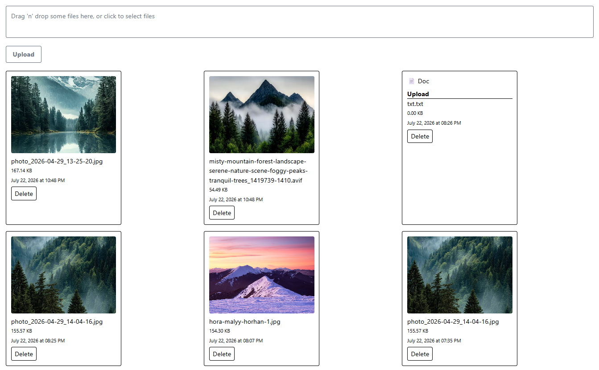

# 🚀 Secure Storage

A full-stack file storage application built with React, TypeScript, Node.js, MongoDB, and Cloudinary.

🌐 Live Demo: https://securesstorage.netlify.app

Secure Storage is a full-stack application that allows users to upload, manage and preview files in the cloud.
The project demonstrates practical experience with React, TypeScript, Node.js, MongoDB, Cloudinary, file processing, and REST API development.

## 🏗 Architecture

```text
React + TypeScript (Netlify)
            │
            ▼
      Express API
         (Render)
            │
     ┌──────┴──────┐
     ▼             ▼
MongoDB Atlas   Cloudinary
 Metadata       File Storage
```

## 🛠 Tech Stack

### Frontend
- React
- TypeScript
- Vite
- Tailwind CSS
- Axios
- React Dropzone

### Backend
- Node.js
- Express.js
- MongoDB
- Multer
- Cloudinary

## ✨ Features

- Upload multiple files at once
- Drag & Drop file upload
- Image, video, audio and document support
- Cloudinary file storage
- MongoDB file metadata storage
- File preview by type
- Delete files from Cloudinary and MongoDB
- Loading skeletons while fetching data
- Automatic gallery updates without page refresh



## 📁 Supported File Types

### Images
- JPG
- JPEG
- PNG
- GIF
- WEBP

### Documents
- PDF
- TXT
- DOC
- DOCX

### Audio
- MP3
- WAV

### Video
- MP4
- WEBM

## 📸 Application Flow

```text
Upload File
      ↓
React Dropzone
      ↓
Express + Multer
      ↓
Cloudinary Storage
      ↓
MongoDB Metadata
      ↓
Gallery Rendering
```

## 🚀 Local Setup

### Frontend

```bash
npm install
npm run dev
```

### Backend

```bash
npm install
npm run start
```

### Environment Variables

```env
MONGO_URI=your_mongodb_connection_string

CLOUD_NAME=your_cloudinary_cloud_name
API_KEY=your_cloudinary_api_key
API_SECRET=your_cloudinary_api_secret
```

## 🎯 Learning Goals

This project was created to practice:

- Full-stack development
- File uploads
- REST API
- MongoDB integration
- Cloudinary integration
- Error handling
- React performance optimization
- State management
- Production deployment
