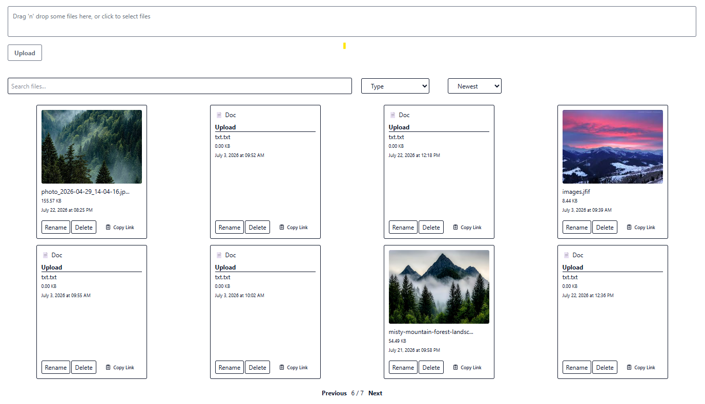

# 🚀 Secure Storage

A full-stack file storage application built with React, TypeScript, Node.js, MongoDB, and Cloudinary.

🌐 Live Demo: https://securesstorage.netlify.app

Secure Storage is a full-stack application that allows users to upload, manage and preview files in the cloud.
The project demonstrates practical experience with React, TypeScript, Node.js, MongoDB, Cloudinary, file processing, and REST API development.

## 🏗 Architecture

```text
React + TypeScript (Netlify)
            │
            ▼
      Express API
         (Render)
            │
     ┌──────┴──────┐
     ▼             ▼
MongoDB Atlas   Cloudinary
 Metadata       File Storage
```

## 🛠 Tech Stack

### Frontend
- React
- TypeScript
- Tailwind CSS
- Axios
- Vite

### Backend
- Node.js
- Express.js
- MongoDB
- Multer
- Cloudinary

## ✨ Features

### File Management
- Multi-file upload
- File deletion with confirmation
- Automatic gallery refresh
- Copy file links to clipboard

### File Support
- Images (JPG, PNG, GIF, WEBP, AVIF)
- Documents (PDF, TXT, DOC, DOCX)
- Audio (MP3, WAV)
- Video (MP4, WEBM)

### Search & Organization
- Server-side search by filename
- Server-side sorting (date and name)
- Server-side pagination for efficient file browsing
- MongoDB query filtering
- Debounced search input

### User Experience
- Drag & Drop uploads
- Loading skeletons
- Responsive UI

### Backend
- Cloudinary integration
- MongoDB metadata storage
- Custom error handling
- File size validation

### Performance
- Debounced search requests
- Optimized database queries with filtering, sorting and pagination



## 📁 Supported File Types

### Images
- JPG
- JPEG
- PNG
- GIF
- WEBP

### Documents
- PDF
- TXT
- DOC
- DOCX

### Audio
- MP3
- WAV

### Video
- MP4
- WEBM

## 📸 Application Flow

```text
Upload File
      ↓
React Dropzone
      ↓
Express + Multer
      ↓
Cloudinary Storage
      ↓
MongoDB Metadata
      ↓
Gallery Rendering
```

## 🚀 Local Setup

### Frontend

```bash
npm install
npm run dev
```

### Backend

```bash
npm install
npm run start
```

### Environment Variables

```env
MONGO_URI=your_mongodb_connection_string

CLOUD_NAME=your_cloudinary_cloud_name
API_KEY=your_cloudinary_api_key
API_SECRET=your_cloudinary_api_secret
```

## 🎯 Learning Goals

This project was created to practice:

- Full-stack development
- File uploads
- REST API
- MongoDB integration
- Cloudinary integration
- Server-side pagination, search, sorting and filtering
- Error handling
- React performance optimization
- State management
- Production deployment
